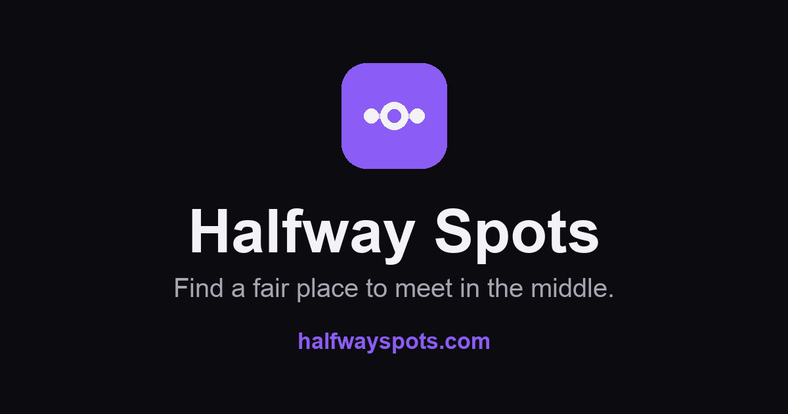

  

<h1 align="center">Halfway Spots</h1>

  <strong>Find a fair place to meet in the middle.</strong> 
  🔗 <a href="https://halfwayspots.com">halfwayspots.com</a>

---

## What it is
**Halfway Spots** takes two locations and finds a **fair meeting point** between them
— the spot where the **driving time** from each side is as balanced as possible
(using live traffic), not just the straight-line geographic middle. It then suggests
**real places to meet** nearby, filterable by type, on an interactive map.

It's a focused tool that does one thing well, instead of a do-everything map app.

## Why it exists
Picking "somewhere in the middle" on a map is a guess — it ignores how long each
person actually has to travel, so the "middle" often isn't fair. Halfway Spots
balances real travel time, and hands you actual venues you can go to.

## Try it
👉 **[halfwayspots.com](https://halfwayspots.com)** — enter two locations and hit
*Find Halfway*.

## Features
- ⚖️ **Travel-time-fair meeting point** (not just the geographic midpoint), with an
  honest "Live traffic" vs "Approximate" badge.
- 🔎 **Live address autocomplete** for both inputs.
- 📍 **Real nearby places** in 7 categories — coffee, food, drinks, parks, hiking,
  dog parks, hotels — as a list and as map pins.
- 🗺️ **Interactive light/dark map** with both locations, the meeting point, and the
  driving route.
- 📏 **Miles/kilometers** toggle and a town/state label for the meeting point.
- ⭐ **User feedback** saved to a real database.
- 🌗 **Dark-first, minimal design** with a remembered light/dark toggle.
- 🛟 Graceful handling of bad input, no results, API hiccups, and errors.

## How the fair point works
1. Get the real driving route between the two locations (traffic-aware).
2. Sample candidate points along that route.
3. Measure the independent drive time from each origin to each candidate.
4. Pick the candidate where the two times are closest — the fair point.

## Built with
React + Vite · Leaflet (CARTO/OpenStreetMap) · Geoapify (geocoding & places) ·
TomTom (traffic-aware routing) · Cloudflare Pages, Functions & D1 · Cloudflare Web
Analytics.

## Roadmap
Up to 5 locations · walking/transit/bicycle modes · "open in Google Maps" from
results · ratings for suggested spots · avoid-tolls/highways · deeper analytics ·
meeting/journey & road-trip planning.

## About
A solo product built end-to-end — from idea and product decisions to a live,
deployed site on a custom domain. The application source code is kept in a private
repository; **access is available to recruiters/collaborators on request.**

> _Screenshots of the live app will be added here. For now, the banner above reflects
> the product's look and feel — see it for real at
> [halfwayspots.com](https://halfwayspots.com)._
