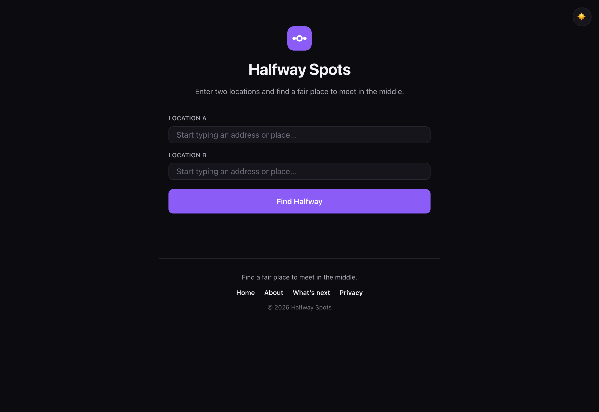
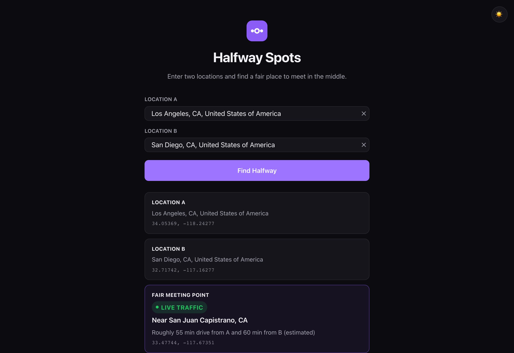
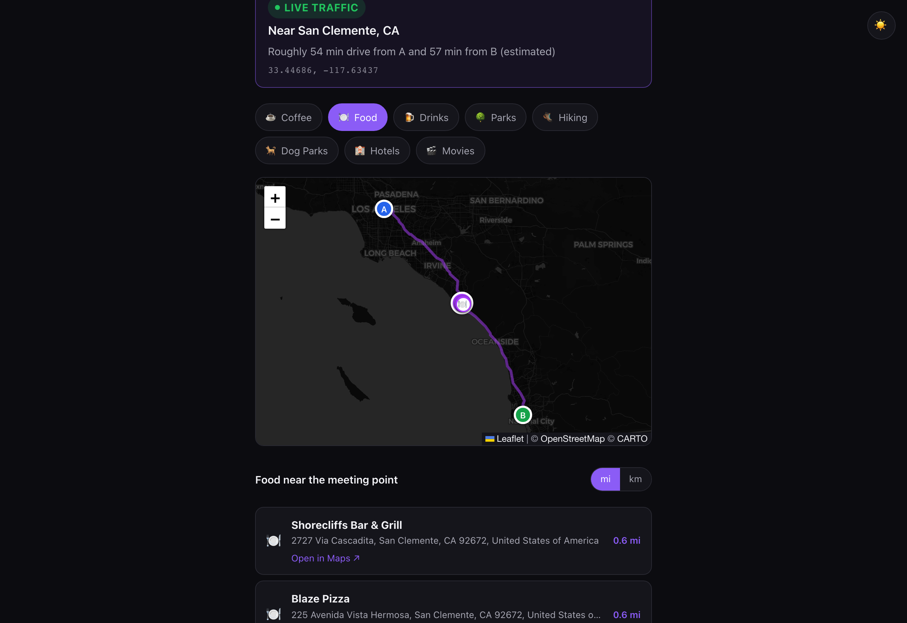

  

<h1 align="center">Halfway Spots</h1>

  <strong>Find a fair place to meet in the middle.</strong> 
  🔗 <a href="https://halfwayspots.com">halfwayspots.com</a>

---

## What it is
**Halfway Spots** takes two locations and finds a **fair meeting point** between them
— the spot where the **driving time** from each side is as balanced as possible
(using live traffic), not just the straight-line geographic middle. It then suggests
**real places to meet** nearby, filterable by type, on an interactive map.

It's a focused tool that does one thing well, instead of a do-everything map app.

## Why it exists
Picking "somewhere in the middle" on a map is a guess — it ignores how long each
person actually has to travel, so the "middle" often isn't fair. Halfway Spots
balances real travel time, and hands you actual venues you can go to.

## Try it
👉 **[halfwayspots.com](https://halfwayspots.com)** — enter two locations and hit
*Find Halfway*.

## Features
- ⚖️ **Travel-time-fair meeting point** (not just the geographic midpoint), with an
  honest "Live traffic" vs "Approximate" badge.
- 👥 **Up to 5 locations** — a fair point for a whole group, with a choice between
  equal travel times or the shortest possible longest trip.
- 🧭 **Driving, Walking & Cycling modes** — pick how the trip is made (Walk and Bike
  are in beta; public transit was evaluated and intentionally not shipped — see Roadmap).
- 🔎 **Live address autocomplete** for both inputs.
- 📍 **Real nearby places** in 9 categories — coffee, food, drinks, parks, hiking,
  dog parks, hotels, movie theaters, and tennis/pickleball courts — as a list and as
  map pins. Each place shows its **Google star rating** and a precise **"Open in
  Google Maps"** link straight to that listing; permanently or temporarily closed
  places are filtered out automatically.
- 🔗 **Share a meeting point** — a clean share/copy link that reopens the spot and
  what's nearby (without revealing anyone's start location).
- 🗺️ **Interactive light/dark map** with both locations, the meeting point, and the
  driving route.
- 📏 **Miles/kilometers** toggle and a town/state label for the meeting point.
- ⭐ **User feedback** saved to a real database.
- 🌗 **Dark-first, minimal design** with a remembered light/dark toggle.
- 🛟 Graceful handling of bad input, no results, API hiccups, and errors.

## Screenshots

  
  
  

<em>Enter two locations · get a travel-time-fair meeting point (live traffic) · see real places nearby on the map.</em>

## How the fair point works
1. Get the real driving route between the two locations (traffic-aware).
2. Sample candidate points along that route.
3. Measure the independent drive time from each origin to each candidate.
4. Pick the candidate where the two times are closest — the fair point.

## Built with
React + Vite · Leaflet (CARTO/OpenStreetMap) · Geoapify (geocoding) · Google Places
(New) for nearby-places accuracy, with a Geoapify fallback · TomTom (traffic-aware
routing) · Cloudflare Pages, Functions & D1 · Cloudflare Web Analytics.

## Security & engineering
Built responsibly, then verified — not assumed:
- 🔑 **No third-party keys in the browser** — traffic-aware routing runs in a
  Cloudflare Function, so the routing key stays server-side; the geocoding key is
  domain-locked.
- 🛡️ **Hardened against injection** — database writes use parameterized queries
  (SQL-injection-safe) and all user/API text is escaped on render (XSS-safe),
  validated with real attack payloads.
- 📜 **Security headers** — Content-Security-Policy plus clickjacking, MIME-sniffing,
  and referrer protections on every response.
- 🚦 **Abuse protection** — the feedback endpoint is validated and rate-limited at
  the edge.
- 🛟 **Graceful degradation** — sensible fallbacks (e.g. geographic midpoint when no
  drivable route exists) and friendly error states instead of blank pages.
- ⚡ **Edge-cached API proxies** — third-party lookups (places, geocoding) run through
  serverless functions with a shared edge cache, so popular areas don't re-pay per
  request — with a direct fallback so nothing breaks if the cache layer is unavailable.

## Roadmap
Moving Walk/Bike's routing engine to Google for better accuracy (with the current
provider as failover) · avoid-tolls/highways · deeper analytics · meeting/journey &
road-trip planning. (Public transit was designed, then deliberately not shipped —
the honest cost/consistency trade-offs weren't worth it yet.)

## About
A solo product built end-to-end — from idea and product decisions to a live,
deployed site on a custom domain. The application source code is kept in a private
repository; **access is available to recruiters/collaborators on request.**
